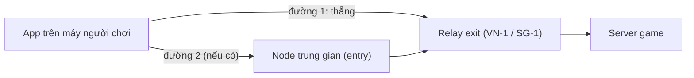

# Goslynk Booster

Latency reducer: game traffic goes through a Linux VPS relay. Client is **Rust** (TUN/route)
with a **Tauri + React** UI.

## Tổng quan (tiếng Việt)

Goslynk Booster làm giống ExitLag: chỉ gói tin của game đi qua một **server relay** nằm gần
server game, còn web, video… vẫn đi mạng thường. Relay có đường tốt tới server game, nên ping
trong game thấp và ổn định hơn so với để nhà mạng tự đi vòng.



**Khi bấm Boost, app tự làm:**

1. Lấy danh sách server relay từ tài khoản (admin quản lý ở tab **Quản trị → Relay**).
2. Chọn server dành riêng cho game đó. Ví dụ Liên Minh/ĐTCL dùng **VN-1**, các game server
   Singapore dùng **SG-1**. Nếu có nhiều server thì app kết nối thử tất cả cùng lúc và giữ
   server nhanh nhất.
3. Đo từng đường tới server đó (đi thẳng, hoặc qua node trung gian) rồi chọn đường nhanh nhất.
4. Mỗi gói game được **gửi 2 bản**. Có 2 đường thì mỗi đường mang 1 bản (multipath), nên một
   đường rớt gói hay giật thì bản kia vẫn tới. Relay giữ bản đến trước và bỏ bản trùng.

Người chơi có thể tự chọn server ở ô **Server** trong từng game trên màn Home (mặc định là
**Tự động**). Server dành riêng cho một game, như VN-1 cho Liên Minh, chỉ hiện ở game đó.

**Các server hiện có**

| Server | Vị trí | Dùng cho | Ghi chú |
|---|---|---|---|
| VN-1 | Việt Nam | Liên Minh Huyền Thoại, Đấu Trường Chân Lý | Cách server LMHT VN ~2,5 ms |
| SG-1 | Singapore | Các game server Singapore (Valorant, CS2, PUBG, Steam, Roblox…) | Mặc định cho mọi game |

Đo thực tế từ mạng FPT Hà Nội: tới VN-1 khoảng 6 ms, **LMHT qua VN-1 khoảng 9 ms**, so với
90–120 ms khi đi qua SG-1 và 26 ms khi dùng ExitLag.

**Thêm node trung gian (entry) để giảm ping và chống rớt gói**

Entry chỉ chuyển tiếp gói UDP tới một exit, không cần PSK hay cài relayd. Entry chỉ có lợi khi
nó đi **nhà mạng khác** với exit, hoặc có đường tới Singapore tốt hơn. Ví dụ VPS Viettel/VNPT
đi thẳng sang Singapore khoảng 30 ms, trong khi FPT đi vòng qua Hong Kong mất khoảng 80 ms.
VN-1 cũng đi FPT, nên không làm entry cho SG-1 được.

1. Trên VPS mới: `sudo relay/deploy/setup-entry.sh sg-1=74.81.54.113:51820` (hoặc
   `vn-1=180.93.117.132:51820`).
2. Trong app: **Quản trị → Relay → Thêm relay**, vai trò **Entry**, chọn exit tương ứng.
3. App tự đo và dùng entry nếu entry nhanh hơn. Nếu entry và đường thẳng nhanh gần bằng nhau,
   app gửi song song qua cả hai.

Kiểm tra relay có multipath hay không:
`go run ./cmd/gpb-multipath-check -relay HOST:51820 [-entry HOST:PORT] -psk-file ./psk`
(chạy trong thư mục `relay/`).

## Layout

```
client-rs/     Rust crates + Tauri app (macOS / Windows)
relay/         Go relayd for Linux VPS
backend/       Accounts API (Node.js + MySQL)
profiles/      Game IP ranges (JSON), compiled into the app
testdata/      Protocol golden vectors
docs/          Protocol & architecture
```

## Client (Tauri)

Pre-fill the relay (optional). Create `client-rs/gpb-app/src-tauri/relay.local.json`; it is
gitignored because it holds the PSK:

```json
{
  "endpoint": "203.0.113.10:51820",
  "psk": "PASTE-THE-PSK-FROM-THE-VPS-HERE"
}
```

The tunnel needs elevated rights on every OS.

**Windows** (PowerShell as Administrator):

```powershell
cd client-rs\gpb-app
npm install
npm run dev            # fetches wintun.dll into src-tauri\wintun\ first
npm run tauri:build    # installer; the exe asks for Administrator
```

**macOS**:

```bash
cd client-rs/gpb-app
npm install
npm run tauri:build
sudo "../target/release/bundle/macos/Goslynk Booster.app/Contents/MacOS/gpb-app"
```

Players sign in with a Goslynk account; the app gets the relay list and PSK from the API after
login. Accounts with the `admin` role get a **Quản trị** screen in the app (developer mode,
roles, locks, relays, PSK, history). Relays can also be managed on the API host:

```bash
node --env-file=/etc/goslynk-api/env src/cli.js list-relays
node --env-file=/etc/goslynk-api/env src/cli.js add-relay vn-1 exit 203.0.113.10:51820 \
  --name "Goslynk VN-1" --location "Việt Nam" --games lol,tft
node --env-file=/etc/goslynk-api/env src/cli.js add-relay vn-1-e1 entry 198.51.100.7:51820 --exit vn-1
```

To point a dev build at a local API: `VITE_API_BASE=http://127.0.0.1:8787/api npm run dev`.

GitHub Actions builds both installers (workflow **Build apps**) into a draft release:
`gh workflow run build.yml --ref hitori-main`.

### Auto-update

Installed apps check `https://74-81-54-113.sslip.io/updates/latest.json` at start and every 30
minutes, and offer the update when its version is newer than their own. CI signs the updater
artifacts and uploads them with `latest.json` to `/srv/goslynk-updates/files` on the VPS (SFTP
user `gsbupdate`, jailed to that folder). To ship an update, bump the version (`VERSION`,
`client-rs/Cargo.toml`, `src-tauri/Cargo.toml`, `tauri.conf.json`, `package.json`,
`package-lock.json`) and push; builds that keep the version do not reach installed apps.

Release builds need the updater signing key (`~/.tauri/goslynk-booster.key`, password in
`goslynk-booster.key.password`; CI has both as secrets). Keep a backup: installed apps only accept
updates signed by it.

```bash
TAURI_SIGNING_PRIVATE_KEY=~/.tauri/goslynk-booster.key \
TAURI_SIGNING_PRIVATE_KEY_PASSWORD="$(cat ~/.tauri/goslynk-booster.key.password)" \
npm run tauri:build
```

### Profiles

Game ranges live in `profiles/*.json` and are compiled into the app. To change them without
rebuilding, put a file named `<game id>.json` (`lol`, `tft`, `pubg`, `valorant`, `cs2`,
`naraka`, `deltaforce`, `wot`, `steam`, `roblox`) in `<app data>/profiles/`:

- Windows: `%APPDATA%\com.goslynk.booster\profiles\`
- macOS: `~/Library/Application Support/com.goslynk.booster/profiles/`

Only route regions close to the relay. A region with `"defaultOn": false` (a server far from
the relay, e.g. Naraka Tokyo or Delta Force Hong Kong from Singapore) stays unticked until the
player asks for it. Which relay a game uses is set by the relay's **games** list in the admin
panel (empty = every game), not by the profile; LoL and TFT (region `vn`) are served by VN-1.

### Daemon (CLI)

Create `client-rs/gpb-mac.json` (or `gpb-win.json`, both gitignored):

```json
{
  "profilePath": "../profiles/lol-vn.json",
  "psk": "PASTE-THE-PSK-FROM-THE-VPS-HERE",
  "relayEndpoint": "203.0.113.10:51820",
  "defaultGameId": "lol",
  "regionIds": ["vn"],
  "clientIdPath": "gpb-client-id",
  "adapterName": "Goslynk Booster",
  "routeWithoutGame": true
}
```

```bash
cd client-rs
cargo build --release -p gpb-daemon
sudo ./target/release/gpb-daemon connect --config gpb-mac.json
```

## Relay (Linux VPS)

Create `gpb.conf` in the repository root (gitignored):

```sh
RELAY_SG_HOST=203.0.113.10
RELAY_SG_USER=root
RELAY_SG_PORT=22
RELAY_SG_KEY=~/.ssh/id_ed25519
RELAY_SG_LISTEN=51820
RELAY_SG_MODE=psk
RELAY_DEFAULT=sg
```

```bash
cd relay
make build
make deploy HOST=root@YOUR_VPS_IP
```

See [relay/README.md](relay/README.md).

## Tests

```bash
cd client-rs && cargo test
cd relay && make test
cd client-rs/gpb-app && npx vite build
```

Protocol details, including DataDup and Multipath: [docs/PROTOCOL-v3.md](docs/PROTOCOL-v3.md).

## License

Proprietary, © Goslynk LLC. See [LICENSE](LICENSE).
